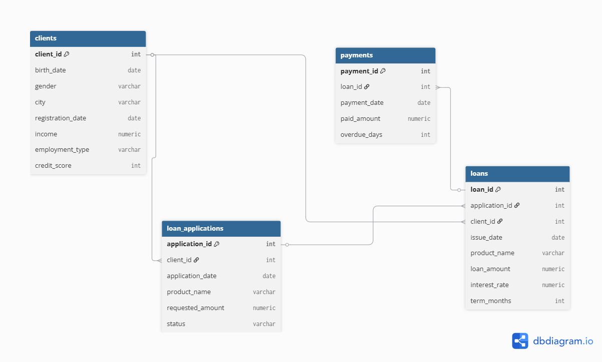
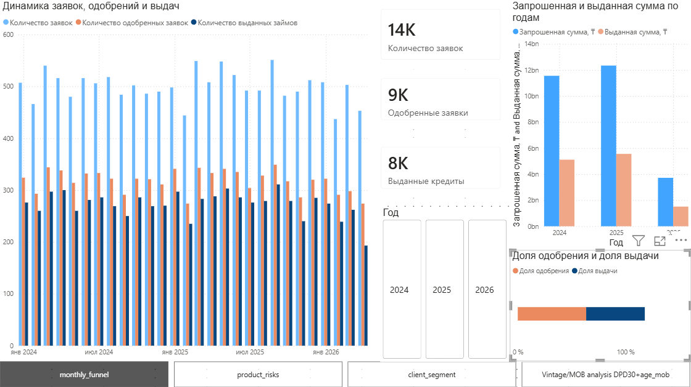
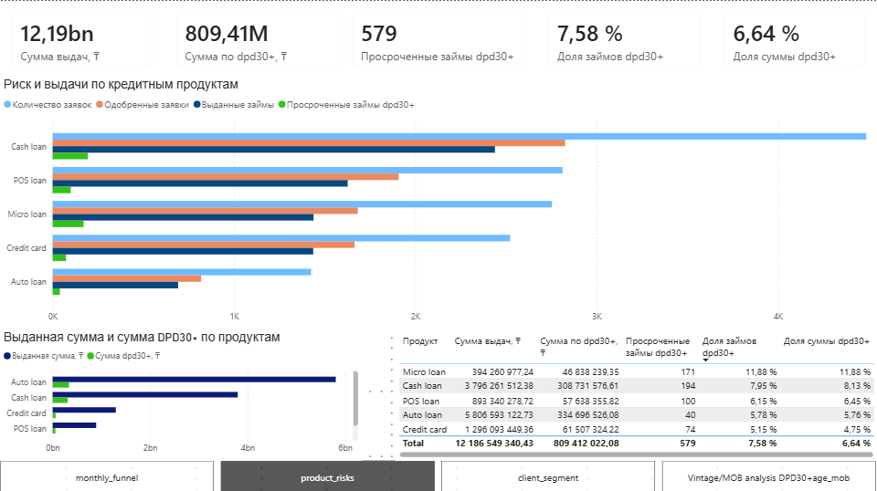
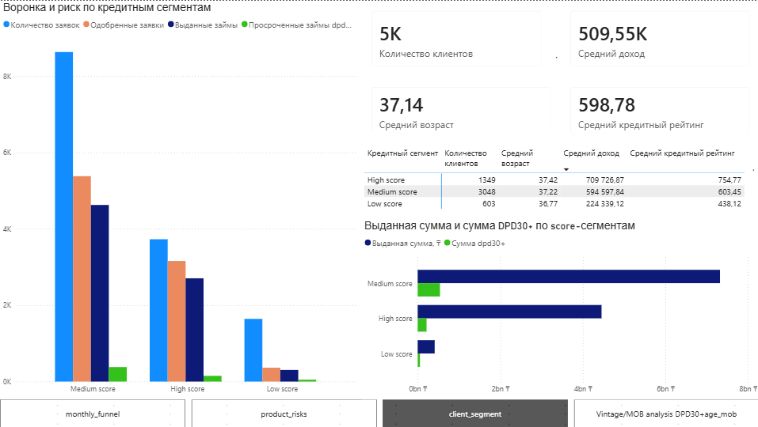
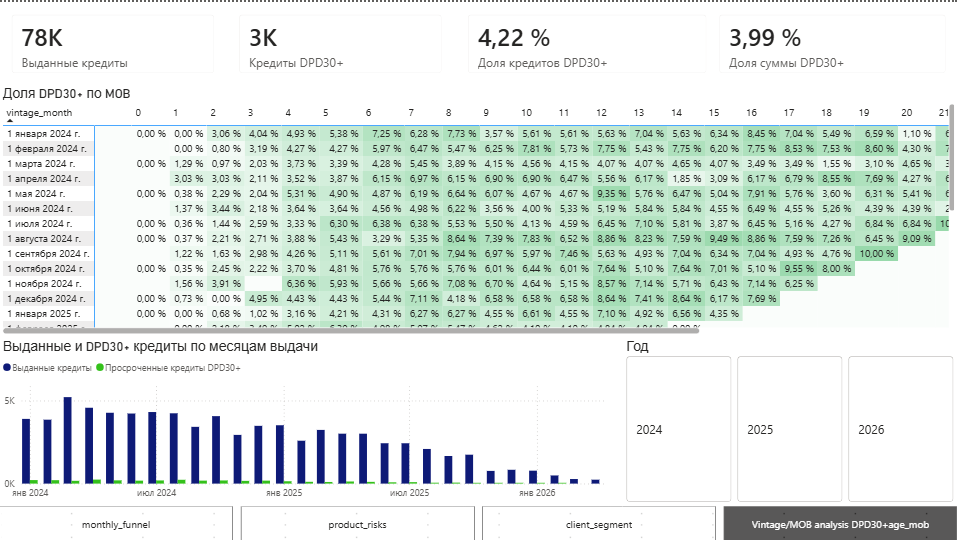

# Credit Portfolio & Risk Analytics

Небольшой аналитический проект по кредитному портфелю банка/финтех-компании.

Я использую синтетические данные за период с января 2024 по апрель 2026 и разбираю путь клиента от подачи заявки до фактической выдачи кредита и дальнейших платежей. Основной фокус проекта — заявки, одобрения, выдачи, клиентские сегменты и ранняя просрочка DPD30+.

---

## О проекте

Идея проекта — посмотреть на кредитный портфель не просто как на набор таблиц, а как на бизнес-процесс: клиент подаёт заявку, банк принимает решение, часть заявок превращается в кредиты, а дальше по этим кредитам появляются платежи и возможная просрочка.

Такой анализ помогает понять:

- как меняется поток заявок;
- насколько стабильно работает воронка одобрений и выдач;
- какие продукты дают больший объём;
- какие клиентские сегменты выглядят более рискованными;
- где появляется повышенная ранняя просрочка.

---

## Данные

В проекте используется модель кредитного портфеля: клиенты, заявки, выданные кредиты и платежи.

- `clients` хранит информацию о клиентах: город, дату рождения, доход, тип занятости и кредитный скоринг.
- `loan_applications` содержит заявки на кредит с датой, продуктом, запрошенной суммой и статусом.
- `loans` показывает только те заявки, которые дошли до фактической выдачи.
- `payments` хранит платежи по кредитам и количество дней просрочки.

Важно, что не каждая заявка становится кредитом: часть заявок отклоняется, часть одобряется, но не доходит до выдачи. А у одного кредита может быть много платежей, поэтому при расчёте просрочки данные по платежам нужно отдельно приводить к уровню одного кредита.

---

## Модель данных

Проект построен на нормализованной модели из четырёх основных таблиц:

- `clients` — клиенты;
- `loan_applications` — заявки на кредит;
- `loans` — фактически выданные кредиты;
- `payments` — платежи по кредитам.

Связи между таблицами отражают кредитный процесс: клиент подаёт заявку, часть заявок превращается в выданные кредиты, а по каждому кредиту формируется история платежей.

- [ER-диаграмма](docs/er_diagram.dbml)
- [Словарь данных](docs/data_dictionary.md)

---

## Что анализирую

В первую очередь я смотрю на кредитную воронку: сколько заявок приходит каждый месяц, какая часть из них одобряется и сколько в итоге превращается в выданные кредиты.

Дальше анализ расширяется по продуктам и клиентским сегментам: объём выдач, средний размер кредита, доля повторных клиентов, ранняя просрочка DPD30+, score-сегменты и vintage/MOB.

Основные метрики проекта:

- количество заявок;
- количество одобренных заявок;
- количество выданных кредитов;
- сумма запрошенных средств;
- сумма выданных кредитов;
- approval rate;
- issue rate;
- DPD30+ rate;
- DPD30+ amount share;
- score-сегмент клиента;
- vintage month;
- month-on-book, MOB.

---

## Инструменты

В проекте используются:

- PostgreSQL
- pgAdmin
- SQL
- Power BI
- DAX
- Python
- pandas
- matplotlib / seaborn
- Jupyter Notebook
- GitHub

На текущем этапе реализованы SQL-анализ, аналитические витрины для BI, Power BI dashboard и Python EDA notebook. Python-анализ дополняет SQL и BI часть проекта: в нём проведены проверки качества данных, собрана аналитическая витрина, рассчитаны ключевые метрики кредитной воронки и визуализированы риск-сегменты.

---

## Структура проекта

Проект разбит на несколько частей:

- `data/` — исходные CSV-файлы;
- `sql/` — SQL-запросы для создания таблиц, проверки данных, анализа и подготовки views для Power BI;
- `insights/` — бизнес-выводы по SQL-анализу и Power BI dashboard;
- `notebooks/` — Python EDA notebook с проверкой качества данных, сбором аналитической витрины, расчётом метрик и визуализациями;
- `insights/business_insights.md` — бизнес-выводы по SQL-анализу и ключевым метрикам проекта;
- `insights/powerbi_dashboard_insights.md` — выводы по страницам Power BI dashboard;
- `powerbi/` — файл Power BI dashboard и скриншоты страниц дашборда;
- `powerbi/screenshots/` — скриншоты страниц дашборда;
- `docs/` — ER-диаграмма и data dictionary;
- `docs/er_diagram.dbml` — DBML-код ER-диаграммы;
- `docs/er_diagram.png` — изображение ER-диаграммы;
- `docs/data_dictionary.md` — описание таблиц, колонок и связей;
- `README.md` — описание проекта.

SQL-файлы разделены по смыслу: отдельно создание таблиц, отдельно проверки качества данных и отдельно аналитические запросы. Так проект проще читать и проверять.

---

## Уже сделано

На текущем этапе:

- создана структура базы данных;
- загружены данные за период с января 2024 по апрель 2026;
- добавлены связи между таблицами;
- написаны проверки качества данных;
- подготовлен SQL-анализ месячной воронки заявок, одобрений и выдач;
- добавлен анализ DPD30+;
- добавлен vintage / MOB-анализ;
- добавлен анализ новых и повторных клиентов;
- добавлен анализ клиентских сегментов по credit_score;
- добавлена папка `insights/` с бизнес-выводами;
- подготовлены SQL views для Power BI dashboard;
- построен Power BI dashboard на 4 страницы:
  - Monthly Funnel;
  - Product Risks;
  - Client Segments;
  - Vintage / MOB;
- добавлены скриншоты страниц dashboard;
- добавлен Python EDA notebook;
- выполнены проверки качества данных в pandas;
- собрана аналитическая витрина на уровне заявки;
- рассчитаны monthly funnel metrics: applications, approvals, issues, approval rate, issue rate, DPD30 rate;
- построены визуализации по кредитной воронке, DPD30+, продуктам, score-сегментам, типу занятости, credit_score и income;
- добавлена ER-диаграмма модели данных;
- добавлен data dictionary с описанием таблиц, колонок и связей.

---

## SQL-анализ

В проекте подготовлены следующие SQL-файлы:

- `01_create_tables.sql` — создание таблиц и связей;
- `02_data_quality_checks.sql` — проверки качества данных;
- `03_monthly_application_funnel.sql` — месячная воронка заявок;
- `04_monthly_product_funnel.sql` — воронка по кредитным продуктам;
- `05_dpd30_analysis.sql` — анализ DPD30+;
- `06_repeat_clients_analysis.sql` — анализ новых и повторных клиентов;
- `07_vintage_mob_analysis.sql` — vintage / MOB-анализ;
- `08_client_segment_analysis.sql` — анализ клиентских сегментов по credit_score;
- `09_powerbi_views.sql` — аналитические SQL views для Power BI dashboard.

---

## Python EDA

В проект добавлен Jupyter Notebook:

- [Python EDA notebook](notebooks/credit_portfolio_eda.ipynb)
- [Открыть через nbviewer](https://nbviewer.org/github/aruzhan-amirova/credit-portfolio-risk-analytics/blob/main/notebooks/credit_portfolio_eda.ipynb)

В ноутбуке выполнены:

- загрузка и первичный обзор данных;
- проверка качества данных: дубли, связи между таблицами, финансовые значения и логика дат;
- агрегация платежей до уровня кредита для корректного расчёта DPD30+;
- сбор аналитической витрины на уровне заявки;
- расчёт monthly funnel metrics;
- визуализация динамики заявок, approval rate, issue rate и DPD30 rate;
- анализ DPD30+ по продуктам, credit_score-сегментам и типу занятости;
- анализ распределения credit_score и income.

Основная логика витрины: одна строка соответствует одной кредитной заявке. Данные по платежам предварительно агрегируются до уровня кредита, чтобы избежать задвоения заявок и кредитов при соединении таблиц.

---

## Power BI Dashboard

Power BI dashboard построен на основе аналитических PostgreSQL views из файла `sql/09_powerbi_views.sql`.

Вместо подключения визуализаций напрямую к сырым таблицам, для dashboard были подготовлены отдельные BI-ready views. Это упрощает модель в Power BI и отделяет SQL-логику подготовки данных от визуализации.

| Страница dashboard | SQL view | Назначение |
|---|---|---|
| Monthly Funnel | `bi_monthly_funnel` | Месячная воронка заявок: заявки, одобрения, выдачи, запрошенная сумма, выданная сумма, approval rate и issue rate |
| Product Risks | `bi_product_risk` | Анализ риска по кредитным продуктам: сумма выдач, кредиты DPD30+, сумма DPD30+, доля кредитов DPD30+ и доля суммы DPD30+ |
| Client Segments | `bi_client_segments` | Анализ клиентских score-сегментов: количество клиентов, средний credit_score, средний доход, сумма выдач и риск DPD30+ |
| Vintage / MOB | `bi_vintage_mob` | Vintage/MOB-анализ динамики DPD30+ по месяцу выдачи кредита и месяцу жизни кредита |

Страницы dashboard:

1. **Monthly Funnel** — динамика заявок, одобрений и выдач.
2. **Product Risks** — риск и выдачи по кредитным продуктам.
3. **Client Segments** — анализ score-сегментов клиентов.
4. **Vintage / MOB** — DPD30+ по месяцам выдачи и месяцам жизни кредита.

---

## Скриншоты dashboard

### Monthly Funnel

### Product Risks

### Client Segments

### Vintage / MOB

---

## Ключевые результаты

- Входящий поток заявок по месяцам относительно стабилен, без явного долгосрочного роста или падения.
- Approval rate находится примерно в диапазоне 58–68%.
- Issue rate в большинстве месяцев держится на уровне 70–90%.
- DPD30+ rate в основной части периода держится примерно на уровне 7–11%.
- Наиболее рискованными продуктами выглядят `Micro loan` и `Cash loan`.
- Сегмент `Low` credit_score показывает самый высокий уровень DPD30+, что подтверждает связь между скорингом и риском.
- Последние месяцы выдач нельзя напрямую сравнивать с более ранними vintage, потому что кредиты ещё недостаточно зрелые для формирования DPD30+.

Подробные выводы доступны в [`insights/business_insights.md`](insights/business_insights.md) и [`insights/powerbi_dashboard_insights.md`](insights/powerbi_dashboard_insights.md).

---

## Возможные улучшения

Основная аналитическая часть проекта завершена: реализованы SQL-анализ, Power BI dashboard, Python EDA, insights, ER-диаграмма и словарь данных.

В дальнейшем проект можно расширить дополнительными бизнес-выводами, более детальным сегментным анализом и новыми страницами Power BI dashboard.

---

**Проект объединяет SQL, Power BI и Python EDA в единую аналитику кредитного портфеля: от подготовки данных и расчёта метрик до визуализации и бизнес-выводов.**
